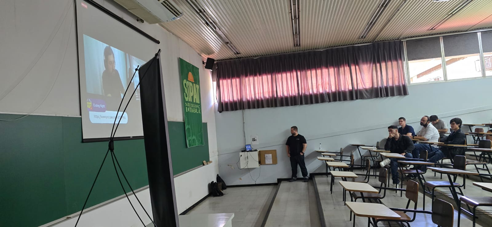
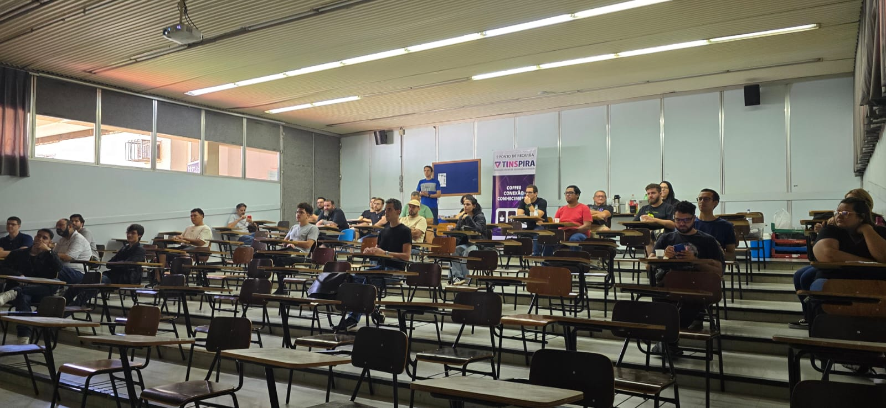
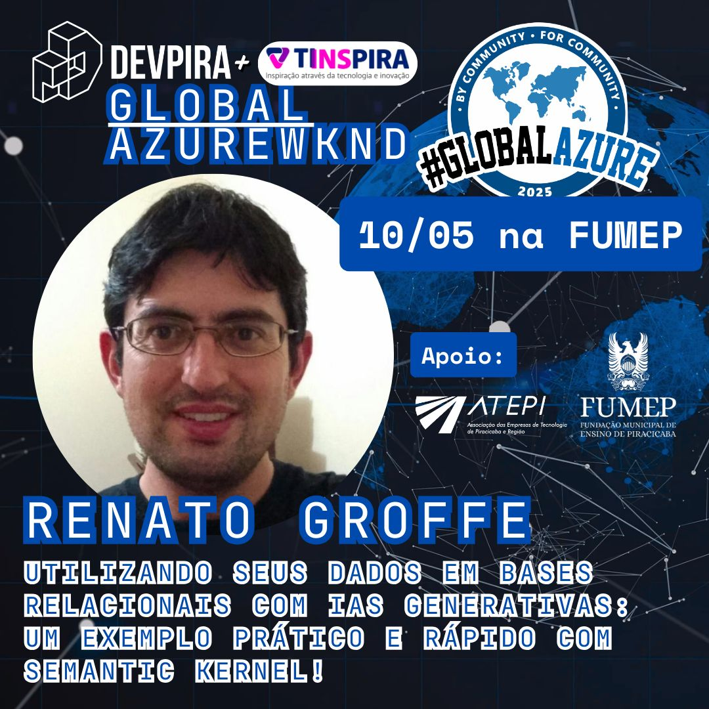
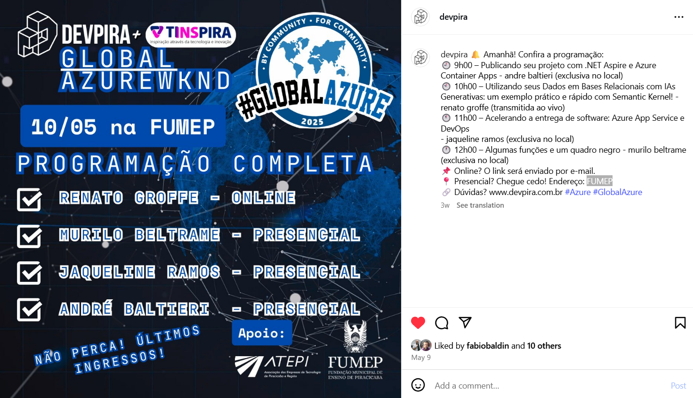
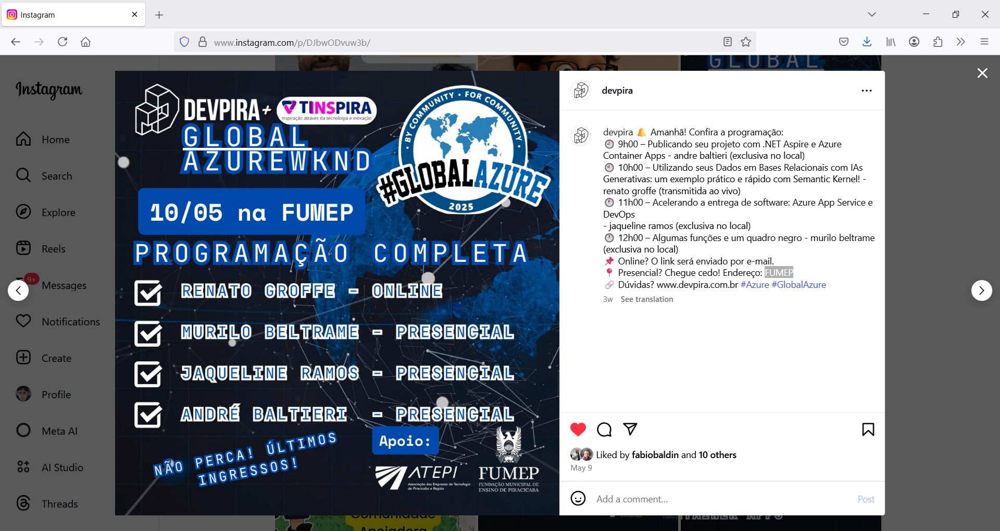

# SemanticKernel-Databases_GlobalAzure2025-DEVPIRA
Conteúdos sobre apresentação envolvendo o uso de Semantic Kernel.

Exemplo apresentado: https://github.com/renatogroffe/dotnet9-semantickernel-postgres_consultaprodutos

---

Título da apresentação: **Utilizando seus Dados em Bases Relacionais com IAs Generativas - Um exemplo prático e rápido com Semantic Kernel!**

Data: **10/05/2025 (sábado)**

Tecnologias abordadas: **.NET, Java, Python, Semantic Kernel, Ollama, Docker, Docker Compose, PostgreSQL, Semantic Kernel, Azure Open AI...**

Evento: **Global Azure 2025**

Número de participantes: **28 pessoas**

Link de divulgação: [**Instagram**](https://www.instagram.com/p/DJbwODvuw3b/)

Local: **Fundação Municipal de Ensino de Piracicaba - FUMEP - Avenida Monsenhor Martinho Salgot, 560 - Areião - Piracicaba - SP - CEP: 13414-040**

Gravação da apresentação: [**YouTube**](https://www.youtube.com/watch?v=E-QWOA0vS0Y)

Deixo aqui meus agradecimentos ao **Alexandre Ballestero**, ao **Fábio Baldin**, ao **Murilo Beltrame** e demais organizadores por todo o apoio para que eu partipasse como palestrante, mesmo que online, de mais um evento promovido pela comunidade **DEVPIRA**.

---

